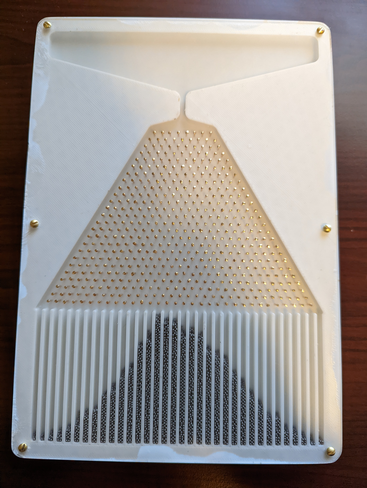

# Galton
A 3D printable Galton board.

This project was made using [CadQuery](https://cadquery.readthedocs.io/en/latest/).

Besides the 3D printed board, here is your shopping list:

- [500 size 8 half inch sequin pins](https://www.amazon.com/gp/product/B08XMWZQK4/)
- [10,000 1 millimeter diameter steel balls](https://www.amazon.com/dp/B098SZFMRD)
- [6 #2 1/2 inch round head wood screws](https://www.menards.com/main/hardware/fasteners-connectors/screws/wood-screws/midwest-fastener-reg-2-slotted-drive-brass-round-head-wood-screws/81363/p-1444440031197-c-8940.htm?tid=-4173749362885105444&ipos=2)
- [an acrylic sheet](https://www.menards.com/main/doors-windows-millwork/acrylic-glass-sheets/amerilux-0-060-thick-non-glare-acrylic-sheets/nga8x10x050/p-1539107081822-c-7551.htm)

The pins are usually available at craft stores, and hardware stores have cheap acrylic sheets and screws. The steel balls probably have to come from the internet.

You may wish to print out `holetest` to make sure that the holes will fit with your specific hardware and your specific printer settings.

The board takes around 0.2 kg of filament, so all together the cost of the materials comes to around $20. Of course, you also need tools to shape the acrylic -- a drill to make the screw holes and a saw to cut it. I also used a router to trim it flush, but that's certainly not necessary. If you are patient, some sand paper could work instead. If you have access to a laser cutter, that would be the ideal tool to shape the acrylic. To make it extra secure, I also ran a line of super glue around the perimeter.

If I make this again, I will include the following changes:

 - make the angles steeper at the top, so that it is less likely for balls to get stuck.
 - remove the screws, use only superglue to hold it together. With how thin the plastic is we would need many more screws to hold it on firmly, so it just would not be worth it.
 - use a standard size of acrylic so that it does not need to be trimmed.